<p align="center">
  
</p>

<h3 align="center">Byapar — ERP for Bangladeshi trading and manufacturing businesses</h3>

<p align="center">
  Accounting, purchasing, import LCs, inventory, sales, production, payroll and VAT on one general ledger, in Bangladeshi Taka (৳).
</p>

<p align="center">
  
  
  
  
  
</p>

<p align="center">
  
</p>

---

## Contents

- [About](#about)
- [Screenshots](#screenshots)
- [Features](#features)
- [Quick start](#quick-start)
- [Running in production](#running-in-production)
- [How the app works](#how-the-app-works)
- [Database](#database)
- [Backups and restore](#backups-and-restore)
- [API](#api)
- [Project structure](#project-structure)
- [Tests](#tests)
- [Tech stack](#tech-stack)

## About

Byapar ("ব্যাপার", business) is a self-hosted ERP built for how a Bangladeshi company actually runs:

- **July–June fiscal year**, with monthly period locks and a year-end close
- **15% VAT** with Mushak tax invoices, credit notes (6.7) and debit notes (6.8)
- **TDS / AIT** deducted from supplier payments and salaries
- **bKash and Nagad** wallets alongside several bank accounts
- **Import LCs** with landed cost (LC margin, insurance, customs duty, C&F)
- **Payroll** with house rent, medical, conveyance, provident fund and festival bonuses
- **English and বাংলা** interface

The demo company is **Jomadder Global Trade**, Tejgaon Industrial Area, Dhaka. Everything runs from one Node process and one SQLite file — there is no database server to install.

## Screenshots

<table>
  <tr>
    <td width="50%">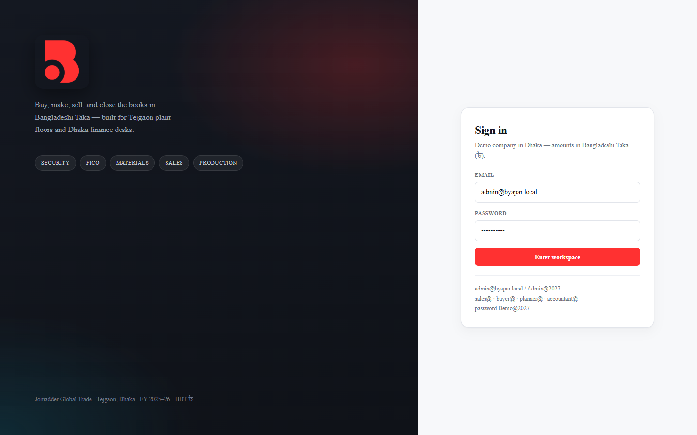<p align="center"><b>Sign in</b></p></td>
    <td width="50%">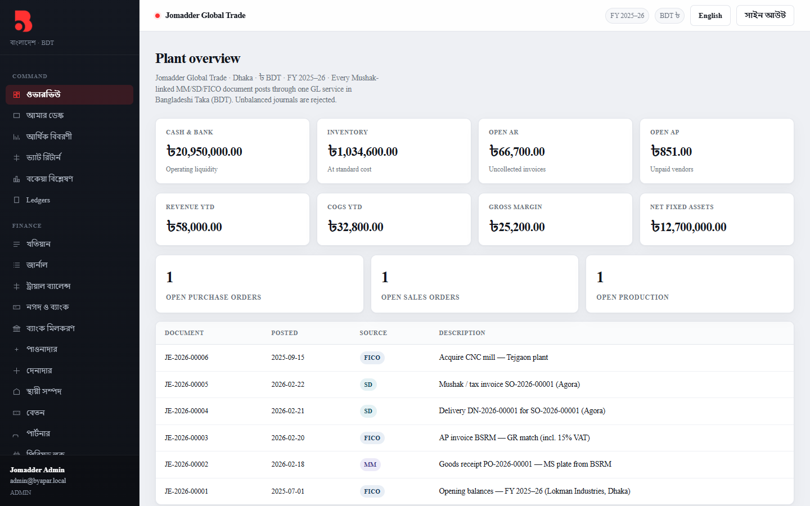<p align="center"><b>বাংলা interface</b> — one click to switch</p></td>
  </tr>
  <tr>
    <td>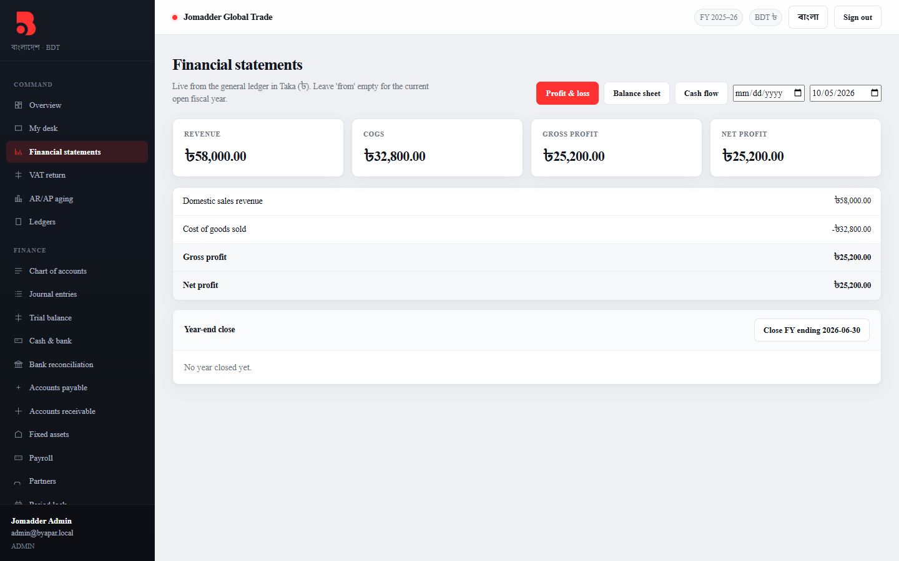<p align="center"><b>Profit &amp; loss</b> — live from the ledger, any date range</p></td>
    <td>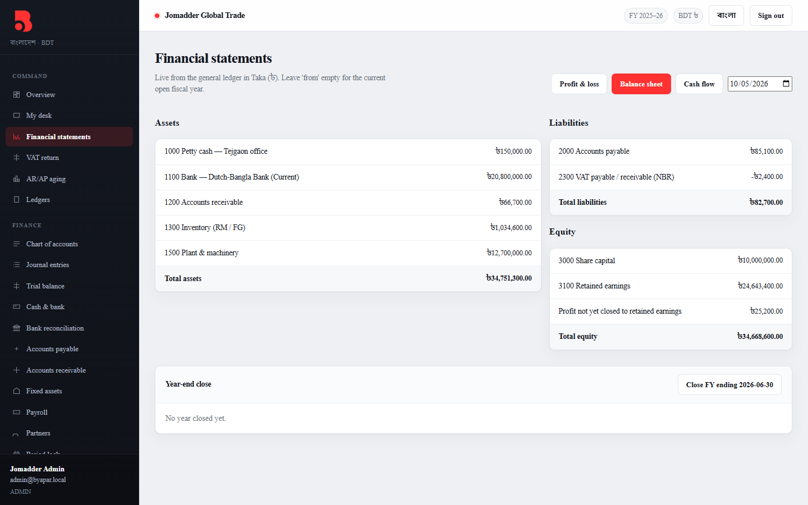<p align="center"><b>Balance sheet</b> with year-end close</p></td>
  </tr>
  <tr>
    <td>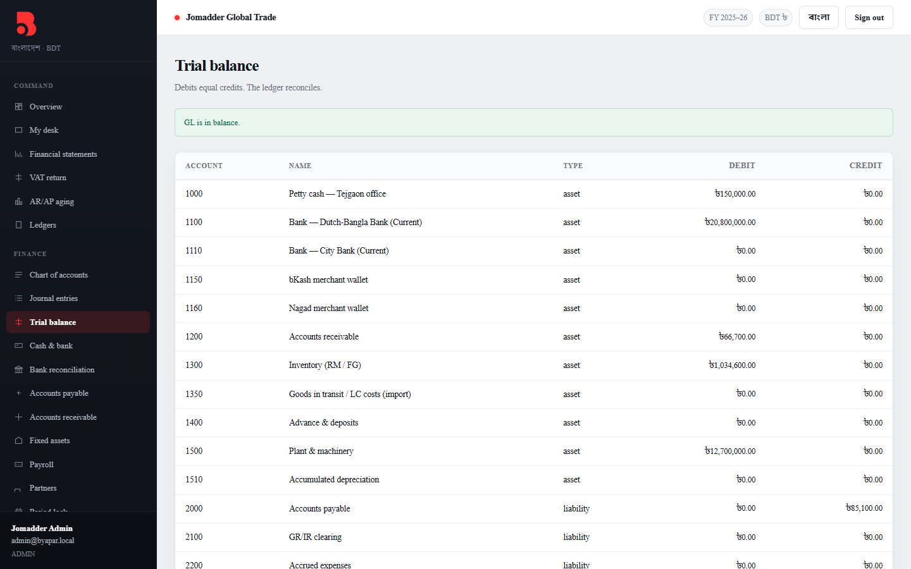<p align="center"><b>Trial balance</b> — always in balance</p></td>
    <td>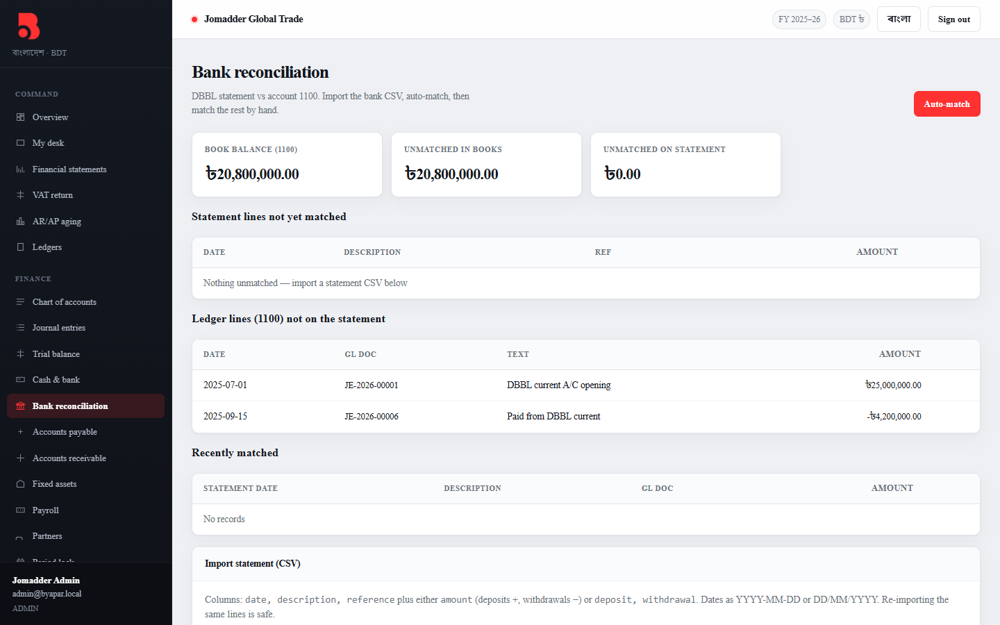<p align="center"><b>Bank reconciliation</b> — CSV import and auto-match</p></td>
  </tr>
  <tr>
    <td>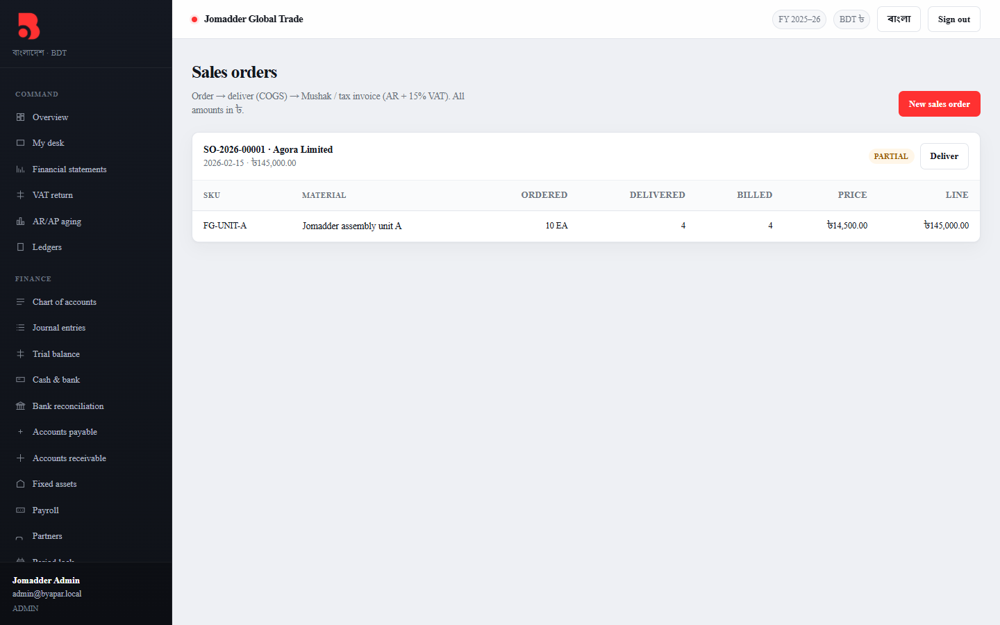<p align="center"><b>Sales orders</b> — deliver, then bill</p></td>
    <td>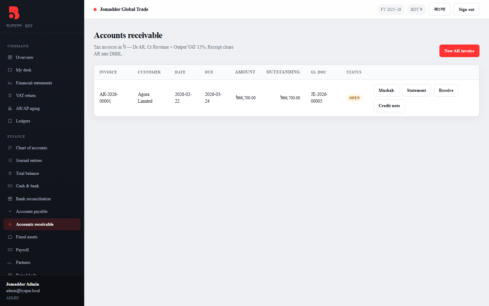<p align="center"><b>Accounts receivable</b> — receipts, credit notes, statements</p></td>
  </tr>
  <tr>
    <td>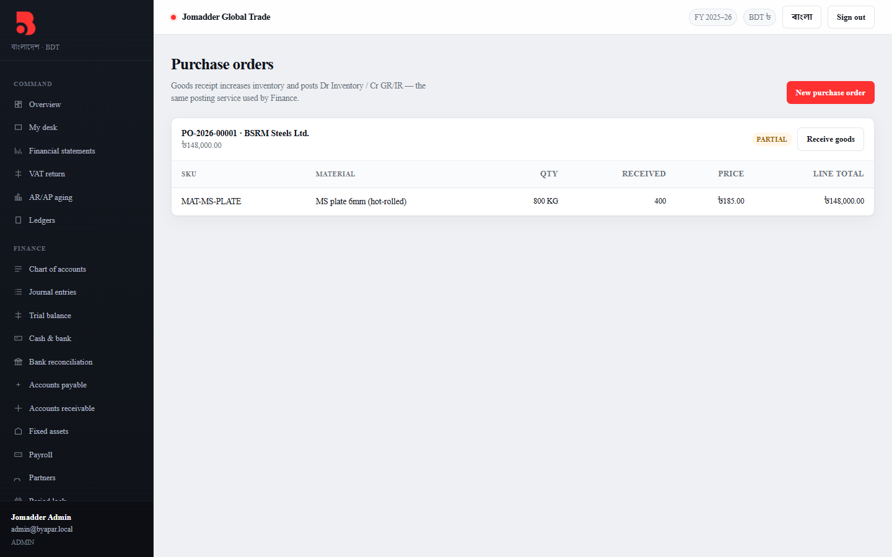<p align="center"><b>Purchase orders</b> — partial goods receipts</p></td>
    <td>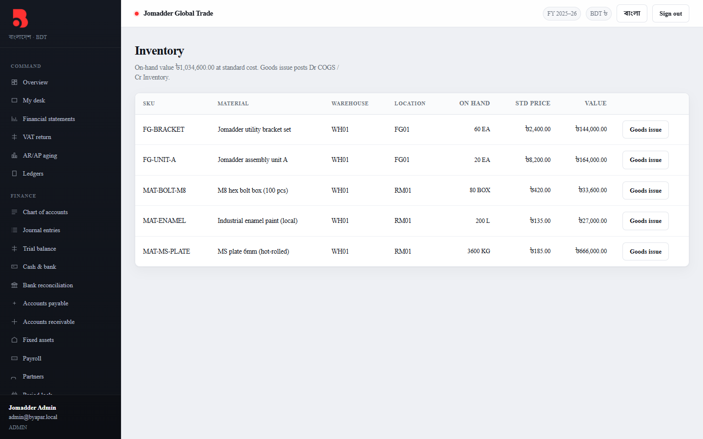<p align="center"><b>Inventory</b> valued at standard cost</p></td>
  </tr>
  <tr>
    <td>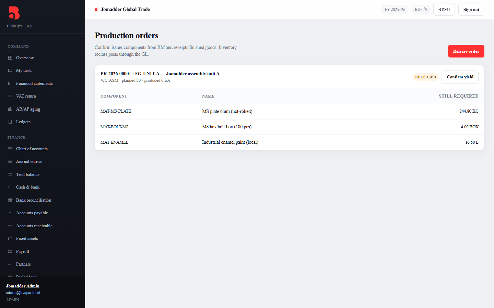<p align="center"><b>Production orders</b> — components from the BOM</p></td>
    <td>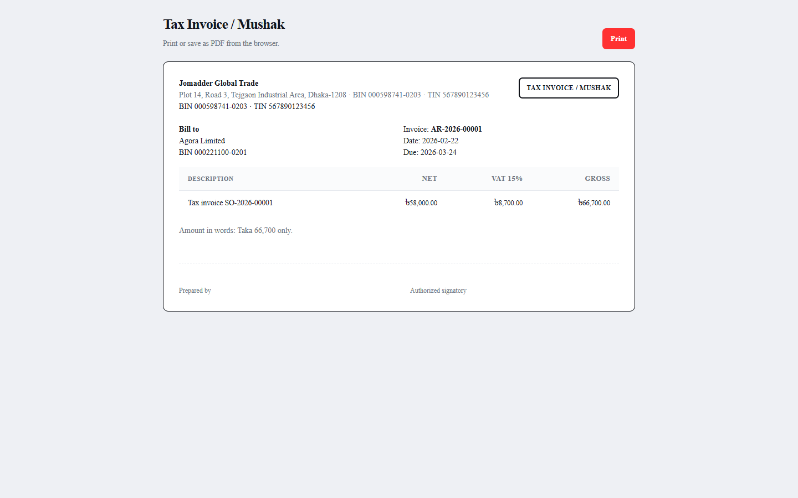<p align="center"><b>Mushak tax invoice</b> — print or save as PDF</p></td>
  </tr>
</table>

## Features

**Finance (FICO)**
- Chart of accounts, journal entries, trial balance, period lock and approvals
- Accounts receivable and payable with partial payments, credit/debit notes (Mushak 6.7 / 6.8) and TDS on vendor payments
- Several bank accounts plus bKash and Nagad wallets, with MFS and bank charges booked automatically
- Bank reconciliation: import the bank's CSV, auto-match, match the rest by hand
- Fixed assets with a once-per-month depreciation run
- P&L, balance sheet, cash flow, year-end close to retained earnings
- AR/AP aging, customer and vendor ledgers, printable customer statement
- VAT return with register CSV export

**Materials (MM)**
- Material master, purchase orders, goods receipt and issue, lots, reorder alerts
- Import LCs with landed cost: LC charges, insurance, customs duty and C&F are added into stock value
- Stock valuation as of any date, reconciled to the inventory account

**Sales (SD)**
- Quotations (printable) that convert to sales orders, customer price lists
- Customer credit limits — orders over the limit go to approval
- Delivery, challan, gate pass, tax invoice (Mushak print), sales returns that put stock back

**Production (PP)**
- Bills of materials, work centers, production confirmation, MRP run

**HR & payroll**
- Employees, monthly salary, provident fund on both sides, salary tax, festival bonus, printable payslips

**Security & operations**
- Role-based access with 6 roles and 32 permissions, full audit trail
- Login lockout after 5 wrong passwords, admin password reset, changing a password signs out every other device
- Automatic daily database backups, CSV import

## Quick start

Requires **Node.js 22.13 or newer** (Byapar uses the built-in `node:sqlite` module, so there is no native database driver to compile).

```bash
git clone https://github.com/mujahidulhaquejihad/Byapar.git
cd Byapar
npm install
npm run dev
```

| Service | URL |
|---|---|
| Web app (Vite dev server) | http://localhost:5173 |
| API | http://localhost:8082 |

On first start the API creates `apps/api/data/erp_bd.sqlite`, builds every table, and seeds the demo company.

### Demo logins

| Email | Password | Role | Can do |
|---|---|---|---|
| `admin@byapar.local` | `Admin@2027` | Administrator | Everything |
| `accountant@byapar.local` | `Demo@2027` | Accountant | Finance, payroll, reports, audit log |
| `buyer@byapar.local` | `Demo@2027` | Buyer | Materials, purchasing, inventory, view payables |
| `sales@byapar.local` | `Demo@2027` | Sales | Quotations, orders, delivery, billing, view receivables |
| `planner@byapar.local` | `Demo@2027` | Production planner | BOMs, production orders, materials |

> **Before using real data:** change every demo password (click your name in the sidebar → My account), and disable users you don't need under **Users & roles**.

To reset the demo, stop the app, delete `apps/api/data/erp_bd.sqlite*` and start again.

## Running in production

```bash
npm start
```

This builds the web app and serves it together with the API on **http://localhost:8082** — one process, one port. Other computers on the office network can open `http://<server-ip>:8082`.

| Variable | Default | Purpose |
|---|---|---|
| `PORT` | `8082` | API and web port |
| `ERP_DB_PATH` | `apps/api/data/erp_bd.sqlite` | Database file location |
| `JWT_SECRET` | random, stored in the database | Login token signing key. Set it if you want to manage it yourself |

## How the app works

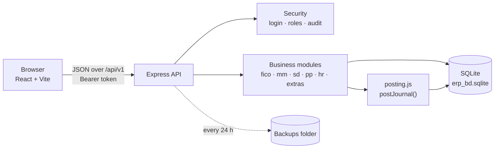

- The **React app** talks to the API only through JSON calls under `/api/v1`. After login it keeps a token (valid 12 hours) and sends it with every request.
- Every API request checks the token, loads the user's roles and permissions, and refuses anything the user isn't allowed to do. Changes are written to the **audit log**.
- **Business modules** own their documents (orders, invoices, payslips…). Whenever a document has money impact, the module calls **`postJournal()`** — the only code allowed to write to the general ledger. It refuses unbalanced entries and entries dated in a locked month.
- A document and its journal are written in **one database transaction**, so you never get an invoice without its accounting entry or the other way round.

### Document flow

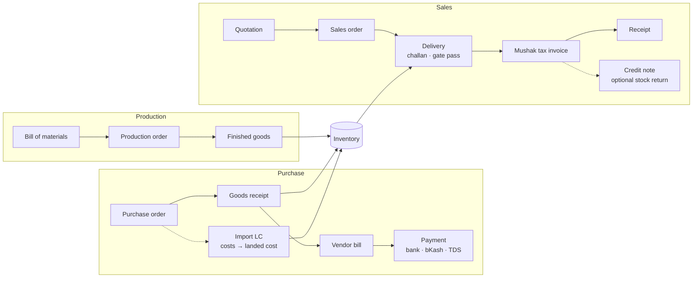

## Database

### At a glance

| | |
|---|---|
| Engine | SQLite through Node's built-in `node:sqlite` (`DatabaseSync`) |
| File | `apps/api/data/erp_bd.sqlite` (override with `ERP_DB_PATH`) |
| Tables | 53 |
| Mode | WAL journal (readers never block the writer), foreign keys ON, 5-second busy timeout |
| Money | Integer **paisa** in every `*_cents` column (৳1,234.50 is stored as `123450`) — no floating-point rounding errors |
| Dates | ISO text: `YYYY-MM-DD` for business dates, `datetime('now')` (UTC) for `created_at` |
| Schema | `apps/api/src/schema.sql`, applied on every start with `CREATE TABLE IF NOT EXISTS` |
| Upgrades | `apps/api/src/migrate.js` adds new columns, sequences, accounts and permissions to older databases automatically |
| Demo data | `apps/api/src/seed.js`, runs only when the `users` table is empty |

### Document numbers

Every document gets a readable number `PREFIX-YEAR-NNNNN` from the `sequences` table, for example `AR-2026-00001`. The number is taken inside the same transaction as the document, so numbers never repeat.

| Prefix | Document | Prefix | Document |
|---|---|---|---|
| `JE` | Journal entry | `SO` | Sales order |
| `PO` | Purchase order | `DN` | Delivery |
| `GR` / `GI` | Goods receipt / issue | `CH` | Delivery challan |
| `AP` / `PAY` | Vendor bill / payment | `GP` | Gate pass |
| `AR` / `RCT` | Tax invoice / receipt | `QT` | Quotation |
| `CN` / `DBN` | Credit / debit note | `PR` | Production order |
| `CV` | Cash voucher | `LOT` | Stock lot |
| `FA` | Fixed asset | `LC` | Import LC |
| `V` / `C` | Vendor / customer | `EMP` / `SAL` | Employee / payroll run |
| `MAT` | Material | | |

### The ledger at the centre

Every money-moving document points to the journal it created (`journal_id`). The journal is the single source of truth for every report.

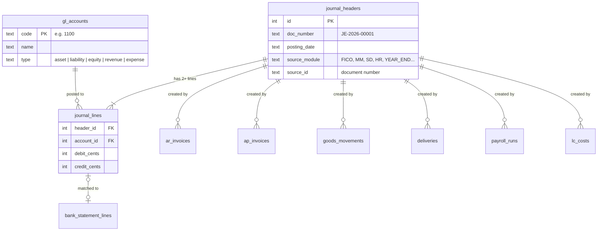

### Purchasing, imports and stock

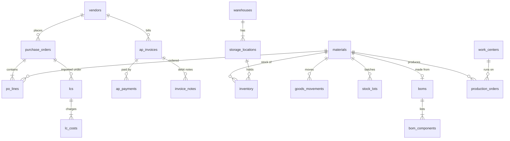

### Sales and receivables

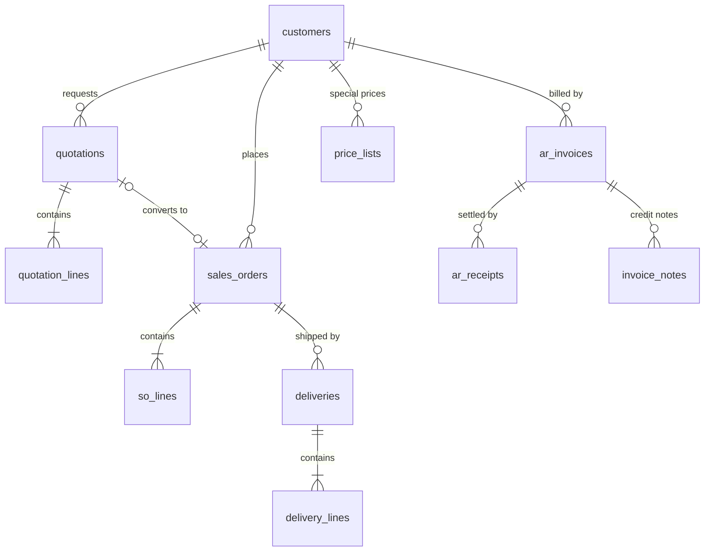

### People, payroll and security

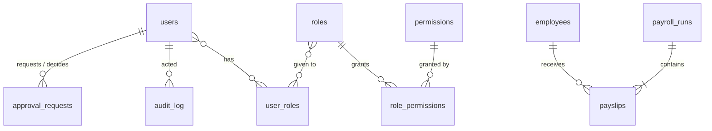

### Table reference

<details>
<summary><b>Finance — 19 tables</b></summary>

| Table | What it holds |
|---|---|
| `gl_accounts` | Chart of accounts: code, name, type (asset / liability / equity / revenue / expense) |
| `journal_headers` | One row per journal entry: number, dates, source module and document |
| `journal_lines` | Debit and credit lines; each entry's lines always sum to zero |
| `fiscal_years` | Fiscal year definitions (July–June) |
| `fiscal_periods` | Months, `open` or `closed`; posting into a closed month is refused |
| `year_closes` | One row per closed fiscal year with its closing journal and profit |
| `ar_invoices` | Customer tax invoices: amount, VAT, settled amount, status (open / partial / paid) |
| `ar_receipts` | Money received against invoices, and which cash / bank / wallet account it went to |
| `ap_invoices` | Vendor bills, same structure as AR |
| `ap_payments` | Payments to vendors, including TDS deducted and the paying account |
| `invoice_notes` | Credit notes (against AR) and debit notes (against AP), with VAT split |
| `cash_transactions` | Cash book: receipts, payments and transfers between cash / bank / wallet accounts |
| `bank_statement_lines` | Imported bank statement rows and the ledger line each one is matched to |
| `fixed_assets` | Assets with cost, useful life and accumulated depreciation |
| `depreciation_runs` | One row per month already depreciated, so it can't run twice |
| `cost_centers` | Tejgaon plant, head office, Gazipur store |
| `approval_requests` | Orders waiting for approval (above the approval limit or over a credit limit) |
| `vendors` | Suppliers with BIN / TIN and payment terms |
| `customers` | Customers with BIN, payment terms and credit limit |

</details>

<details>
<summary><b>Materials, imports and production — 15 tables</b></summary>

| Table | What it holds |
|---|---|
| `materials` | Item master: SKU, type (raw / semi / finished / consumable), unit, standard price, reorder levels |
| `warehouses` | Physical stores |
| `storage_locations` | Areas inside a warehouse (raw materials, finished goods, shop floor) |
| `inventory` | Quantity on hand per material and location |
| `goods_movements` | Every stock change — receipts (GR) and issues (GI) — with cost and source document |
| `stock_lots` | Batch / lot numbers with manufacture date |
| `purchase_orders`, `po_lines` | Purchase orders and their lines, with quantity received so far |
| `lcs` | Import letters of credit linked to a purchase order, `open` or `allocated` |
| `lc_costs` | Charges booked against an LC (LC margin, insurance, duty, C&F, transport) |
| `boms`, `bom_components` | Bills of materials with scrap percentage |
| `work_centers` | Machines / lines with capacity and hourly cost |
| `production_orders` | Planned and produced quantities per finished item |
| `gate_passes` | Vehicles in and out of the factory gate |

</details>

<details>
<summary><b>Sales — 7 tables</b></summary>

| Table | What it holds |
|---|---|
| `quotations`, `quotation_lines` | Price offers with validity date; status open / converted / cancelled |
| `sales_orders`, `so_lines` | Orders with quantities ordered, delivered and billed per line |
| `deliveries`, `delivery_lines` | What was shipped, from which location, with challan number |
| `price_lists` | Customer-specific price and discount per material |

</details>

<details>
<summary><b>HR & payroll — 3 tables</b></summary>

| Table | What it holds |
|---|---|
| `employees` | Salary structure: basic, house rent, medical, conveyance, PF %, monthly tax, pay account |
| `payroll_runs` | One salary or bonus run per month (can't run twice), with totals and journal |
| `payslips` | One row per employee per run: every earning and deduction |

</details>

<details>
<summary><b>Security and system — 9 tables</b></summary>

| Table | What it holds |
|---|---|
| `users` | Login accounts: email, bcrypt password hash, status, token version (bumped to sign out every device) |
| `roles`, `permissions` | 6 roles and 32 permission codes such as `fico.ar.write` |
| `role_permissions`, `user_roles` | Which role has which permission, which user has which role |
| `audit_log` | Who did what and when, with before / after snapshots and IP address |
| `sequences` | Next number for each document type |
| `company_profile` | Company name, address, BIN, TIN and bank details printed on documents |
| `app_settings` | Key / value settings: approval limit, backup folder, last backup time, login token secret |

</details>

### Chart of accounts

| Code | Account | Type | Code | Account | Type |
|---|---|---|---|---|---|
| 1000 | Petty cash — Tejgaon office | Asset | 2400 | Short-term bank loan | Liability |
| 1100 | Bank — Dutch-Bangla Bank | Asset | 2500 | TDS / AIT payable (NBR) | Liability |
| 1110 | Bank — City Bank | Asset | 2600 | Provident fund payable | Liability |
| 1150 | bKash merchant wallet | Asset | 3000 | Share capital | Equity |
| 1160 | Nagad merchant wallet | Asset | 3100 | Retained earnings | Equity |
| 1200 | Accounts receivable | Asset | 4000 | Domestic sales revenue | Revenue |
| 1300 | Inventory (RM / FG) | Asset | 4100 | Other income | Revenue |
| 1350 | Goods in transit / LC costs | Asset | 5000 | Cost of goods sold | Expense |
| 1400 | Advance & deposits | Asset | 5100 | Salaries & wages | Expense |
| 1500 | Plant & machinery | Asset | 5150 | Festival bonus | Expense |
| 1510 | Accumulated depreciation | Asset (contra) | 5200 | Factory rent / lease | Expense |
| 2000 | Accounts payable | Liability | 5300 | Depreciation expense | Expense |
| 2100 | GR/IR clearing | Liability | 5400 | Electricity (DPDC) | Expense |
| 2200 | Accrued expenses | Liability | 5900 | Other operating expenses | Expense |
| 2300 | VAT payable / receivable (NBR) | Liability | 5950 | Bank & MFS charges | Expense |

Any account numbered **1000–1199** is treated as cash: it appears in every "paid from / received into" picker and in the cash flow statement. To add another bank or wallet, add an account in that range.

### What each transaction posts

| Business event | Debit | Credit |
|---|---|---|
| Goods receipt against a PO | 1300 Inventory | 2100 GR/IR |
| Vendor bill | 5900 Expense, 2300 Input VAT | 2000 Payable |
| Vendor payment | 2000 Payable, 5950 Bank charge | Bank / wallet, 2500 TDS |
| Delivery to customer | 5000 COGS | 1300 Inventory |
| Tax invoice (billing) | 1200 Receivable | 4000 Revenue, 2300 Output VAT |
| Customer receipt | Bank / bKash / Nagad, 5950 MFS fee | 1200 Receivable |
| Credit note | 4000 Revenue, 2300 VAT | 1200 Receivable |
| ↳ with stock returned | 1300 Inventory | 5000 COGS |
| LC charge paid | 1350 Goods in transit | Bank / wallet |
| LC allocation | 1300 Inventory (5000 for stock already sold) | 1350 Goods in transit |
| Production confirmation | 1300 Inventory (finished goods) | 1300 Inventory (raw materials) |
| Fixed asset purchase | 1500 Plant & machinery | 1100 Bank, or 2000 Payable if bought on credit |
| Monthly depreciation | 5300 Depreciation | 1510 Accumulated depreciation |
| Salary run | 5100 Salaries (gross + employer PF) | 2600 PF, 2500 Salary tax, Bank (net pay) |
| Festival bonus | 5150 Festival bonus | Bank |
| Year-end close | Each revenue account | Each expense account, difference to 3100 Retained earnings |

### Rules the database enforces

- **Balanced journals** — debits must equal credits, every line is either a debit or a credit (never both, never zero), and every account must exist.
- **Locked months** — nothing can be posted with a date inside a `closed` fiscal period. Year-end close locks the whole year.
- **No double runs** — depreciation once per month, salary once per month, each bonus once, each fiscal year closed once (enforced with primary keys and unique constraints).
- **No over-payment** — receipts, payments and notes can't exceed what's still open on an invoice.
- **Referential integrity** — foreign keys are ON, so a line can never point to an account, material, customer or document that doesn't exist.
- **All or nothing** — every document and its journal are saved in a single `BEGIN IMMEDIATE` transaction.

### Looking inside the database

The file opens in any SQLite tool, for example [DB Browser for SQLite](https://sqlitebrowser.org/) or the `sqlite3` command line. Open it **read-only** while Byapar is running. Useful queries:

```sql
-- Trial balance
SELECT a.code, a.name,
       SUM(l.debit_cents)  / 100.0 AS debit,
       SUM(l.credit_cents) / 100.0 AS credit
FROM journal_lines l JOIN gl_accounts a ON a.id = l.account_id
GROUP BY a.id ORDER BY a.code;

-- Unpaid customer invoices
SELECT i.invoice_no, c.name, i.due_date,
       (i.amount_cents - i.settled_cents) / 100.0 AS outstanding
FROM ar_invoices i JOIN customers c ON c.id = i.customer_id
WHERE i.status IN ('open', 'partial') ORDER BY i.due_date;

-- Stock on hand with value
SELECT m.sku, m.name, SUM(v.qty_on_hand) AS qty,
       SUM(v.qty_on_hand) * m.std_price_cents / 100.0 AS value
FROM inventory v JOIN materials m ON m.id = v.material_id
GROUP BY m.id ORDER BY value DESC;
```

> The database file contains your company's books, every user's password hash and the login token secret. Treat it — and every backup — like a confidential document.

## Backups and restore

While the API runs it copies the database every 24 hours into `C:\Users\<you>\Byapar Backups` (or `~/Byapar Backups`) and keeps the newest 14. The copy is made with SQLite's `VACUUM INTO`, so it is consistent even while people are working.

- **Change the folder** under **Import / backup** — another drive, a USB disk or a synced cloud folder are all good choices. The page warns you if backups are on the same drive as the database.
- **Download a copy** on demand from the same page.
- **Restore:** stop Byapar, copy a backup over `apps/api/data/erp_bd.sqlite`, delete the `-wal` and `-shm` files beside it, and start again.

## API

All endpoints live under `/api/v1` and need a `Authorization: Bearer <token>` header, except login.

| Prefix | Area |
|---|---|
| `POST /auth/login`, `/auth/me`, `/auth/change-password` | Sign in and account |
| `/users`, `/roles`, `/audit` | User management, roles, audit log |
| `/fico/...` | Ledger, accounts, AP/AR, notes, assets, depreciation, periods, year-end |
| `/mm/...` | Materials, purchase orders, goods movements, inventory, LCs, stock valuation |
| `/sd/...` | Quotations, price lists, sales orders, deliveries, billing |
| `/pp/...` | BOMs, work centers, production orders, MRP |
| `/hr/...` | Employees, payroll runs, payslips |
| `/ops/...` | Cash book, bank reconciliation, aging, ledgers, VAT return, printing, imports, backups, approvals |
| `/reports/pnl`, `/reports/balance-sheet`, `/reports/cash-flow` | Financial statements (`from`, `to`, `asOf` as `YYYY-MM-DD`) |
| `/dashboard` | Dashboard figures |

Amounts are sent and received in Taka (e.g. `1234.5`); the API converts to paisa before saving.

## Project structure

```
apps/
  api/                      Express API
    src/
      index.js              Server, routes, static web hosting
      db.js                 SQLite connection, transactions, document numbers
      schema.sql            All 53 tables
      migrate.js            Upgrades older databases in place
      seed.js               Demo company
      posting.js            postJournal() — the only writer to the ledger
      auth.js               Tokens, permission checks
      audit.js              Audit log
      backup.js             Daily backups
      dashboard.js          Dashboard, P&L, balance sheet, cash flow
      modules/
        security.js         Login, users, roles, lockout
        fico.js             Finance
        mm.js               Materials, purchasing, LCs
        sd.js               Sales
        pp.js               Production
        hr.js               Payroll
        extras.js           Cash book, bank rec, printing, VAT, imports, approvals
    test/posting.test.js    Test suite
  web/                      React + Vite front end
    src/
      App.jsx               Routes
      Shell.jsx             Sidebar and top bar
      api.js                API client
      i18n.jsx              English / বাংলা text
      ui.jsx                Shared components
      pages/                One file per screen
docs/screenshots/           Images used in this README
```

## Tests

```bash
npm test
```

23 tests covering the posting rules, partial payments, credit and debit notes, stock returns, TDS, bKash fees, LC allocation, payroll, credit limits, balance sheet and cash flow, year-end close, login lockout, session sign-out and backups. Tests run against a temporary database and never touch your data.

## Tech stack

| Layer | Tools |
|---|---|
| Front end | React, React Router, Vite |
| API | Node.js, Express, Zod (input validation) |
| Database | SQLite via `node:sqlite` |
| Security | JWT login tokens, bcrypt password hashing, role-based permissions |
| Tests | `node:test` |
